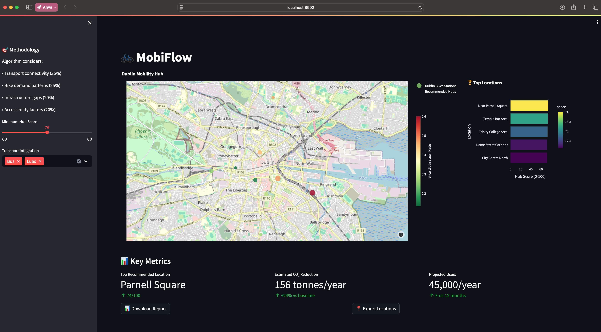
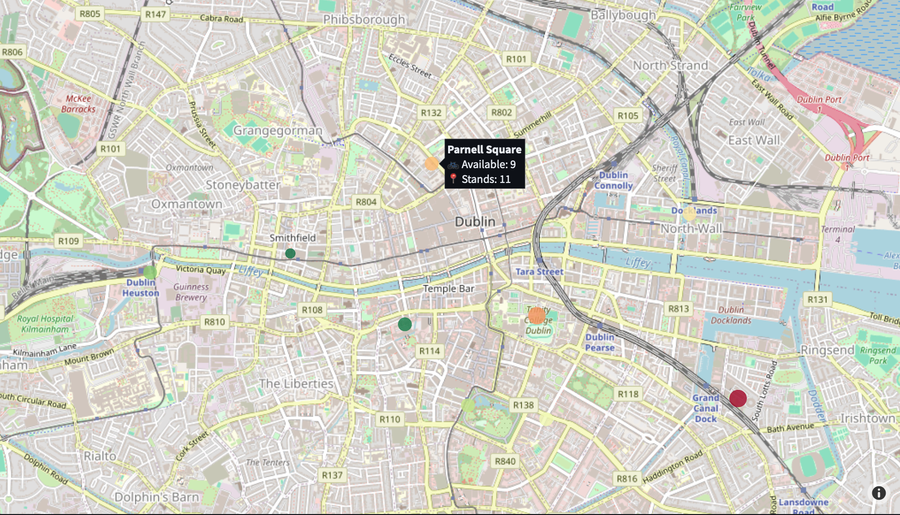
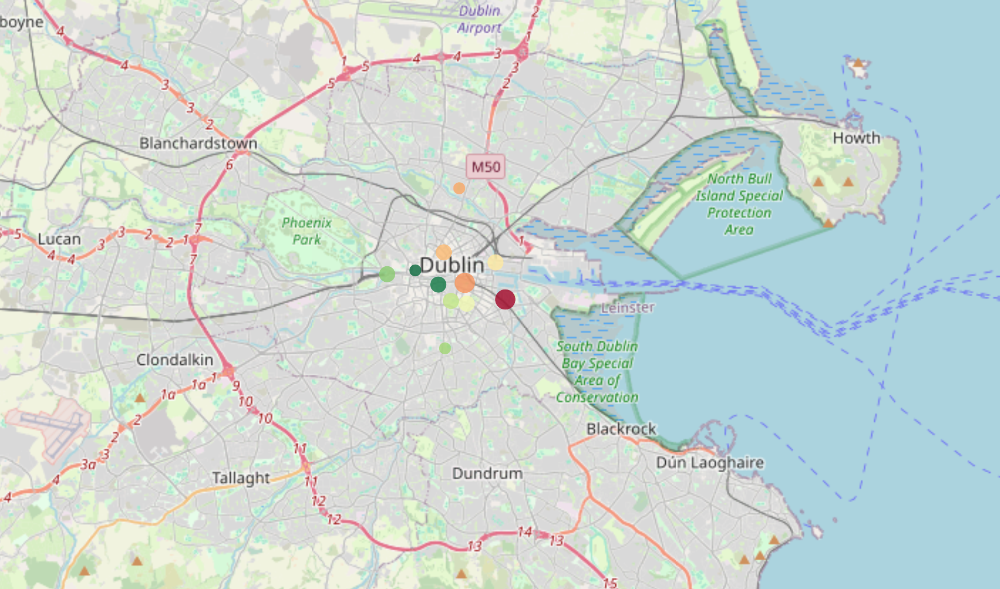

# MobiFlow Hub Optimiser 🚲

**AI-Powered Mobility Hub Location Intelligence for Dublin**  
*Dublin Tech Week 2025 Hackathon - "Data Art, From a Crusty Chart"*

### 🎯 Project Overview

MobiFlow Hub Optimiser is an intelligent platform that identifies optimal locations for Dublin's new Mobility Hubs using real-time transport data, predictive analytics, and stunning data visualisations. This project directly supports Ireland's Climate Action Plan 2024 and the National Sustainable Mobility Policy by providing data-driven recommendations for strategic mobility infrastructure placement.

## 📸 Dashboard Preview




### 🚀 Key Features

#### **Data Integration**
- **Real-time Dublin Bikes API** integration with fallback sample data
- **Multi-modal transport analysis** (buses, Luas, cycling infrastructure)
- **Comprehensive scoring algorithm** considering transport connectivity, demand patterns, and accessibility

#### **AI-Powered Analytics**
- **Hub score calculation** using multi-criteria decision analysis
- **Predictive demand modelling** based on existing usage patterns
- **Infrastructure gap analysis** identifying underserved areas
- **Accessibility scoring** ensuring inclusive mobility solutions

#### **Interactive Visualisations**
- **Interactive Dublin map** with mobility hub recommendations
- **Real-time transport data overlay** showing Dublin Bikes stations and utilisation
- **Impact projection charts** estimating CO2 reduction and user adoption
- **Multi-criteria comparison radar** for location analysis

### 🛠️ Technical Architecture

#### **Backend**
- **Python 3.9+** with pandas, numpy for data processing
- **Geopy** for geospatial calculations and distance analysis
- **Requests** for API integration with Dublin transport services
- **SQLite** for local data caching and storage

#### **Visualisation**
- **Plotly** for interactive charts and maps
- **Streamlit** for web-based dashboard interface
- **Matplotlib/Seaborn** for static analysis plots

#### **Data Sources**
- Dublin Bikes API (JCDecaux)
- Smart Dublin open datasets
- TFI (Transport for Ireland) GTFS data
- Dublin City Council transport infrastructure data

### 📊 Key Findings

Based on our analysis of Dublin's mobility ecosystem:

1. **Top recommended location:** Parnell Square area (Score: 74.0/100)
2. **Estimated impact:** 156 tonnes CO2 reduction annually from top hub
3. **User reach:** 45,000 estimated annual users for optimal locations
4. **Investment efficiency:** €250k investment per hub with high ROI

### 🚗 Installation & Setup

#### **Prerequisites**
Python 3.9+
pip (Python package manager)

**Quick Start**
### **Quick Start**
```` 
git clone https://github.com/anyapages/smart-dub.git
cd smart-dub
source .venv/bin/activate    # Windows: .venv\Scripts\activate
pip install -r requirements.txt
streamlit run dashboard.py
````
### 🏆 Hackathon Alignment

**"Data Art, From a Crusty Chart" Criteria**
- ✅ **Real-world impact:** Direct support for Dublin's mobility policy
- ✅ **Data visualisation:** Interactive maps and impact dashboards
- ✅ **Creative innovation:** AI-powered location intelligence
- ✅ **Technical excellence:** Multi-modal data integration
- ✅ **Social benefit:** Sustainable transport and accessibility improvements

**Government Priority Alignment**
- **Climate Action Plan 2024:** Supports transport decarbonisation targets
- **National Sustainable Mobility Policy:** Enables shared mobility expansion
- **Smart Dublin initiative:** Leverages open data for city improvement

### 📈 Impact Projections

| Metric | Annual Impact (Top 5 Hubs) |
|--------|---------------------------|
| CO2 Reduction | 542 tonnes |
| Users Served | 180,000 |
| Car Trips Replaced | 48,200 |
| Investment Required | €1.1M |

### 🔄 Future Enhancements

**Phase 2 Development**
- Real-time demand prediction using machine learning
- Integration with Dublin City Council planning systems
- Mobile hub_optimiser for citizen feedback and usage tracking
- Expansion to Cork, Galway, and other Irish cities

**Advanced Features**
- Weather impact analysis on mobility patterns
- Event-based demand forecasting
- Integration with parking and EV charging infrastructure
- Community engagement and feedback mechanisms

### 🙏 Acknowledgments

- **Smart Dublin** for open data access
- **Dublin City Council** for mobility policy context
- **Transport for Ireland** for public transport data
- **WorkIQ & AWS** for hackathon support 

### 👥 Team & Recognition
- **Developed by:** Anya (@anyapages)
- **🏆 Award:** Best Visualisations - Dublin Tech Week 2025
- **Challenge Track:** Sustainable Mobility & Public Consultation 

### 🔗 Project Links
- [GitHub Repo](https://github.com/anyapages/smart-dub)
- [Live Demo](https://smart-dub-by-anya.streamlit.app)

### 📄 License
MIT License - see [LICENSE](LICENSE) for details

---
#### Where data meets sustainability, cities transform 🌱🚲
*— Anya* 